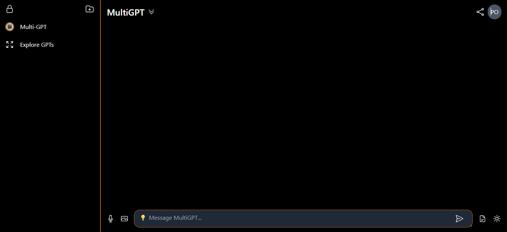

Overview

This is a chat-gpt clone that contains the features of a typical chatbot, enabling users to get human-like interective responses to questions and simple conversations.

Features
1. speech-to-text
2. Image recognition and description
3. Profile management and settings
4. User friendly interface
5. Dark and light modes

Technologies
Open-AI API
Tailwind CSS
JavaScript
HTML
CSS